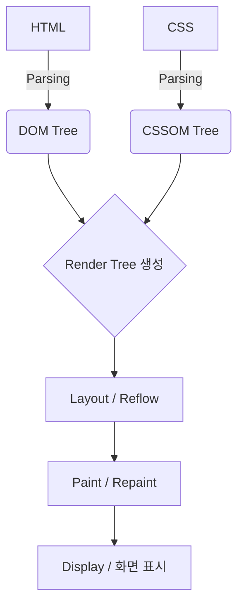

# 웹 개발 기초 정리

<details>
<summary><b>1. HTML (HyperText Markup Language)</b>: 웹 페이지의 <b>구조</b>를 정의하는 마크업 언어</summary>

- **요소(Element):** 시작 태그, 내용, 종료 태그로 구성됩니다. (예: `<p>내용</p>`)
- **주요 태그:**
  - `<html>`: 전체 문서의 루트 요소
  - `<head>`: 문서의 메타데이터(제목, 스타일 링크 등) 포함
  - `<body>`: 사용자에게 보이는 실제 콘텐츠
  - `<h1>` ~ `<h6>`: 제목(Heading)
  - `<a>`: 하이퍼링크 (href 속성 사용)
  - ``: 이미지 (src, alt 속성 사용)
  - `<div>`, `<span>`: 레이아웃 구분을 위한 컨테이너
- **시맨틱 태그(Semantic Tags):** `<header>`, `<footer>`, `<main>`, `<section>` 등 의미를 가진 태그를 사용하여 SEO와 웹 접근성을 높입니다.
</details>

<details>
<summary><b>2. CSS (Cascading Style Sheets)</b>: HTML 요소의 <b>디자인과 레이아웃</b>을 담당</summary>

- **기본 구조:** `선택자 { 속성: 값; }`
- **선택자(Selector):**
  - 타입 선택자: `p { ... }`
  - 클래스 선택자: `.className { ... }`
  - ID 선택자: `#idName { ... }`
- **박스 모델(Box Model):**
  - **Content:** 실제 내용
  - **Padding:** 테두리와 내용 사이의 안쪽 여백
  - **Border:** 테두리
  - **Margin:** 요소와 요소 사이의 바깥쪽 여백
- **레이아웃 기술:**
  - **Flexbox:** 1차원 레이아웃(행 또는 열) 배치에 최적화
  - **Grid:** 2차원 레이아웃(행과 열 모두) 배치에 최적화
- **반응형 디자인:** `@media` 쿼리를 사용하여 화면 크기에 따라 스타일 변경
</details>

<details>
<summary><b>3. JavaScript (JS)</b>: 웹 페이지에 <b>상호작용과 동적 기능</b>을 추가하는 프로그래밍 언어</summary>

- **변수 선언:** `var` (오래된 방식), `let` (재할당 가능), `const` (상수)
- **데이터 타입:** String, Number, Boolean, Object, Array, Null, Undefined 등
- **함수(Function):** 
  ```javascript
  function add(a, b) {
    return a + b;
  }
  // 화살표 함수
  const multiply = (a, b) => a * b;
  ```
- **DOM(Document Object Model) 조작:** 
  - `document.querySelector()` 등을 사용하여 HTML 요소 선택
  - `element.addEventListener('click', ...)`로 이벤트 처리
- **비동기 처리:** `Promise`, `async/await`를 사용하여 네트워크 요청 등 시간이 걸리는 작업 처리
</details>

<details>
<summary><b>4. 클라이언트(Client)와 서버(Server)</b></summary>

- **클라이언트 (Client):** 서비스를 사용하는 단말기나 브라우저. 서버에 데이터를 **요청(Request)**합니다. (예: Chrome, Safari, 모바일 앱)
- **서버 (Server):** 클라이언트의 요청을 받아 처리하고 결과를 **응답(Response)**하는 컴퓨터. 데이터를 저장하거나 복잡한 연산을 수행합니다.
- **HTTP/HTTPS:** 클라이언트와 서버가 서로 통신하기 위해 지켜야 하는 규칙(프로토콜)입니다.
</details>

<details>
<summary><b>5. 프론트엔드(Frontend)와 백엔드(Backend)</b>: 웹 개발의 두 영역</summary>

- **프론트엔드 (Frontend):** 사용자에게 직접적으로 보여지는 영역. 디자인, 레이아웃, 버튼 클릭 시 반응 등을 구현합니다.
  - **기술 스택:** HTML, CSS, JavaScript, React, Vue, Next.js 등
- **백엔드 (Backend):** 사용자에게 보이지 않는 뒷단. 데이터베이스 관리, 사용자 인증, 비즈니스 로직 처리 등을 담당합니다.
  - **기술 스택:** Node.js, Python(Django), Java(Spring), MySQL, MongoDB 등
</details>

<details>
<summary><b>6. 정적(Static)과 동적(Dynamic)</b>: 콘텐츠 생성 방식의 차이</summary>

- **정적 웹 페이지 (Static Web Page):**
  - 서버에 미리 저장된 파일(HTML, CSS, 이미지 등)을 그대로 전달합니다.
  - 모든 사용자가 같은 화면을 보게 되며, 서버의 가공 없이 빠르게 전달됩니다.
- **동적 웹 페이지 (Dynamic Web Page):**
  - 사용자의 요청에 따라 서버가 **컨테이너(Container)**에서 코드를 **실행**하고, **데이터베이스(Database)**와 연동하여 실시간으로 결과를 만듭니다.
  - **방식 1. 결과가 HTML 형식 (Dynamic 1):**
    - 서버에서 실행 코드와 HTML을 결합하여 완성된 HTML 페이지를 생성해 전달합니다.
    - 예: `login.jsp`, `index.php` 등 (서버 사이드 렌더링)
  - **방식 2. 결과가 Data 형식 (Dynamic 2):**
    - 서버는 순수하게 **데이터(JSON, XML 등)**만 생성하여 전달합니다.
    - 브라우저가 이 데이터를 받아 자바스크립트로 화면을 동적으로 그립니다.
    - 예: `{"name": "Kelly", ...}` 와 같은 JSON 데이터 (현대적인 웹 앱/API 방식)
</details>

<details>
<summary><b>7. MPA와 SPA</b>: 페이지 전환 방식에 따른 구분</summary>

- **MPA (Multi Page Application):**
  - 새로운 페이지를 요청할 때마다 서버로부터 **완전한 HTML**을 받아오는 전통적인 방식입니다.
  - 페이지 이동 시 화면 전체가 깜빡이며(새로고침) 로딩됩니다.
  - **특징:** 검색 엔진 최적화(SEO)에 유리하지만, 매번 전체 화면을 로딩하므로 속도가 상대적으로 느릴 수 있습니다.
- **SPA (Single Page Application):**
  - 하나의 HTML 페이지에서 필요한 **데이터만** 서버로부터 받아와 자바스크립트로 화면을 부분적으로 업데이트하는 현대적인 방식입니다.
  - 페이지 이동 시 새로고침 없이 부드럽게 화면이 전환됩니다.
  - **특징:** 앱처럼 매끄러운 사용자 경험을 제공하지만, 초기 로딩 속도가 느릴 수 있고 SEO 설정이 복잡할 수 있습니다. (예: React, Vue, Angular 사용)
</details>

<details>
<summary><b>8. 브라우저 렌더링 과정</b>: 화면이 그려지는 단계</summary>

- **1) DOM(Document Object Model) 생성:** HTML 파싱 후 트리 구조의 객체 모델을 만듭니다.
- **2) CSSOM(CSS Object Model) 생성:** CSS 파싱 후 스타일 정보를 담은 객체 모델을 만듭니다.
- **3) Render Tree 생성:** DOM과 CSSOM을 결합하여 화면에 실제로 **보여질** 요소들로만 구성된 트리를 만듭니다. (`display: none` 제외)



- **4) Layout (Reflow):** 각 노드가 화면의 어느 위치에, 어떤 크기로 배치될지 계산하는 과정입니다.

- **5) Paint (Repaint):** 계산된 정보를 바탕으로 실제 화면에 색을 입히고 픽셀을 채우는 과정입니다.

#### **성능 최적화 핵심 개념**
- **Reflow (리플로우):** 요소의 크기나 위치(너비, 높이, 위치 등)가 변경되어 Layout 단계부터 다시 수행되는 현상입니다. (비용이 큼)
- **Repaint (리페인트):** 요소의 크기 변화 없이 배경색, 가시성 등 시각적인 요소만 변경되어 Paint 단계만 다시 수행되는 현상입니다.
- **Tip:** 성능을 위해 가능한 Reflow를 줄이고, GPU 가속 등을 활용하는 것이 좋습니다.
</details>


